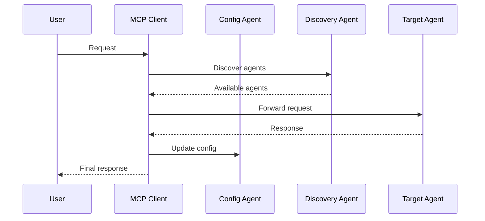

# MCP Client with A2A Integration

This project implements a Model Control Protocol (MCP) client with Agent-to-Agent (A2A) protocol support, providing a robust framework for agent discovery, communication, and tool management.

## Architecture

The system consists of several interconnected components:

1. **MCP Client** (`test_script.py`)
   - Handles MCP protocol communication
   - Manages tool discovery and execution
   - Integrates with A2A agents for configuration

2. **A2A Agents**
   - Config Agent (Port 1001): Manages MCP tool configurations
   - Discovery Agent (Port 1002): Handles agent discovery and registration
   - Routing Agent (Port 1003): Routes requests to appropriate agents
   - History Agent (Port 1004): Manages conversation history
   - Bridge Agent (Port 1005): Handles protocol translations

3. **Weave Integration**
   - Automatic tracing of MCP calls
   - A2A communication monitoring
   - Performance metrics collection

## Protocol Implementation

### A2A Protocol
- Agent Cards exposed at `/.well-known/agent.json`
- Port-based discovery (1000-1010 range)
- JSON-RPC 2.0 communication
- Standardized message format

### MCP Protocol
- Version: 2024-11-05
- Tool discovery and execution
- Session management
- Configuration handling

## Getting Started

1. Start the Config Agent:
   ```bash
   python config_server.py
   ```

2. Run the MCP client:
   ```bash
   python test_script.py
   ```

3. View traces in Weave:
   ```bash
   weave ui
   ```

## Agent Communication Flow



## Directory Structure

```
project/
├── docs/
│   ├── README.md
│   ├── agents/
│   │   ├── config_agent.md
│   │   ├── discovery_agent.md
│   │   └── routing_agent.md
│   ├── protocols/
│   │   ├── a2a.md
│   │   └── mcp.md
│   └── weave/
│       └── integration.md
├── src/
│   ├── test_script.py
│   ├── config_agent.py
│   └── config_server.py
└── README.md
```

## Contributing

See [CONTRIBUTING.md](./CONTRIBUTING.md) for guidelines on contributing to this project.

## License

MIT License - see [LICENSE](./LICENSE) for details. 