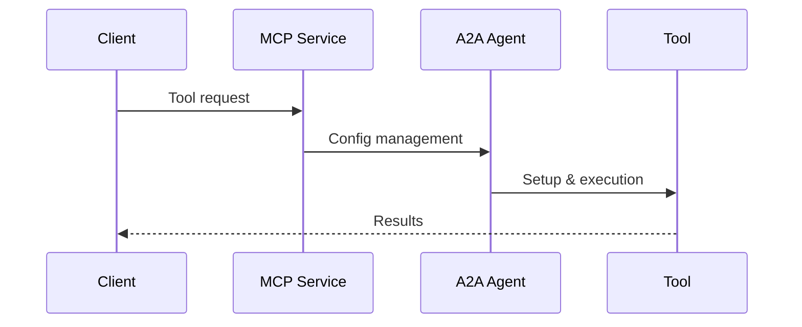

# Model Context Protocol (MCP) Implementation

## Overview

The Model Context Protocol (MCP) is an open standard by Anthropic that provides a unified interface for LLM applications to interact with external tools, data, and prompts. Our implementation focuses on tool discovery, execution, and configuration management.

## Core Components

### 1. Tools
- External functions that models can execute
- Standardized JSON-RPC 2.0 interface
- Tool discovery and metadata
- Execution context and parameters

### 2. Resources
- Structured data references
- Document and data access
- Context management
- Version control

### 3. Prompts
- Template management
- Behavior structuring
- Consistency controls
- Efficiency patterns

## Protocol Implementation

### Headers
```python
MCP_HEADERS = {
    "MCP-Protocol-Version": "2024-11-05",
    "Content-Type": "application/json",
    "Accept": "application/json"
}
```

### Session Management
```python
# Initialize session
payload = {
    "jsonrpc": "2.0",
    "id": "uuid-string",
    "method": "initialize",
    "params": {
        "protocol_version": "2024-11-05"
    }
}
```

### Tool Operations

1. **List Tools**
```json
{
    "jsonrpc": "2.0",
    "id": "uuid-string",
    "method": "tools/list"
}
```

2. **Search Tools**
```json
{
    "jsonrpc": "2.0",
    "id": "uuid-string",
    "method": "tools/call",
    "params": {
        "name": "search_tools",
        "arguments": {
            "query": "search query",
            "max_results": 5
        }
    }
}
```

3. **Tool Details**
```json
{
    "jsonrpc": "2.0",
    "id": "uuid-string",
    "method": "tools/call",
    "params": {
        "name": "get_tool_detail",
        "arguments": {
            "tool_id": "tool-id"
        }
    }
}
```

## Integration with A2A

MCP and A2A work together through:
1. Tool configuration management
2. Protocol translation
3. Context sharing
4. Unified tracing



## Error Handling

Standard error responses:
```json
{
    "jsonrpc": "2.0",
    "id": "request-id",
    "error": {
        "code": -32000,
        "message": "Error description"
    }
}
```

Common error codes:
- -32700: Parse error
- -32600: Invalid request
- -32601: Method not found
- -32602: Invalid params

## Security Considerations

1. **Authentication**
   - Session-based auth
   - Tool-specific credentials
   - Secure storage

2. **Input Validation**
   - Parameter validation
   - Schema enforcement
   - Size limits

3. **Access Control**
   - Tool permissions
   - Resource scoping
   - Rate limiting

## Best Practices

1. **Tool Design**
   - Clear documentation
   - Consistent interfaces
   - Proper error handling

2. **Resource Management**
   - Efficient caching
   - Version control
   - Change tracking

3. **Prompt Engineering**
   - Template versioning
   - Context optimization
   - Response validation

## Example Implementation

```python
class MCPClient:
    async def initialize(self) -> bool:
        """Initialize MCP session"""
        payload = {
            "jsonrpc": "2.0",
            "id": str(uuid.uuid4()),
            "method": "initialize",
            "params": {
                "protocol_version": MCP_VERSION
            }
        }
        # ... implementation details ...

    async def list_tools(self) -> Optional[Dict]:
        """List available tools"""
        payload = {
            "jsonrpc": "2.0",
            "id": str(uuid.uuid4()),
            "method": "tools/list"
        }
        # ... implementation details ...

    async def search_tools(self, query: str) -> Optional[Dict]:
        """Search for tools"""
        payload = {
            "jsonrpc": "2.0",
            "id": str(uuid.uuid4()),
            "method": "tools/call",
            "params": {
                "name": "search_tools",
                "arguments": {
                    "query": query,
                    "max_results": 5
                }
            }
        }
        # ... implementation details ...
```

## Testing

Test scenarios should cover:
1. Session management
2. Tool operations
3. Error conditions
4. Security measures
5. Performance metrics 