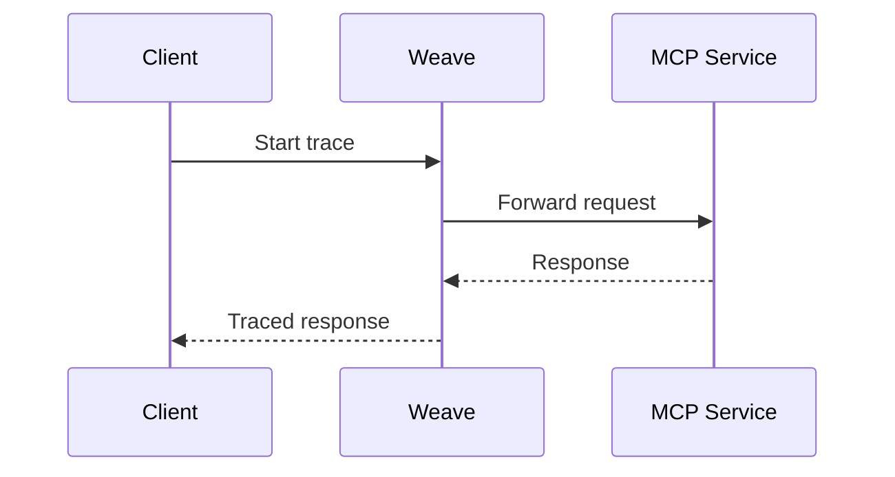
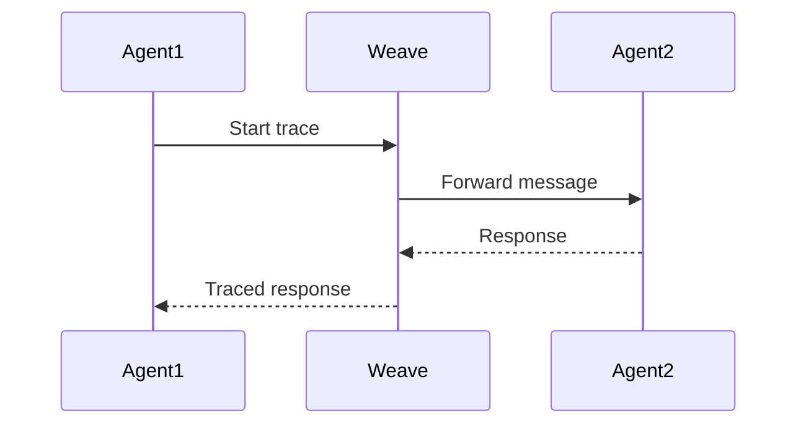

# Weave Integration

## Overview

[Weights & Biases (W&B) Weave](https://wandb.ai/site/weave) provides built-in observability for MCP and A2A protocols. This integration enables automatic tracing and monitoring of agent interactions, tool executions, and system performance.

## Features

1. **Automatic Tracing**
   - MCP protocol calls
   - A2A agent communication
   - Tool execution flows
   - Performance metrics

2. **Visualization**
   - Agent interaction graphs
   - Execution timelines
   - Performance dashboards
   - Error tracking

3. **Analytics**
   - Response time analysis
   - Error rate monitoring
   - Resource utilization
   - Pattern detection

## Implementation

### 1. Initialization

```python
import weave

# Initialize Weave for MCP client
weave.init("wv_mcp")

# Initialize Weave for Config Agent
weave.init("wv_mcp_config_agent")
```

### 2. Operation Tracing

```python
@weave.op()
async def handle_mcp_tool_response(self, response_data: Dict) -> Dict:
    """Handle response from MCP add_tool and update configuration"""
    # Implementation details...
```

### 3. Span Management

```python
with weave.trace("mcp_tool_execution") as span:
    span.set_attribute("tool_name", tool_name)
    span.set_attribute("tool_id", tool_id)
    # Tool execution logic...
```

## Integration Points

### 1. MCP Protocol



### 2. A2A Protocol



## Data Collection

1. **Request/Response Data**
   - Payload contents
   - Headers
   - Timing information
   - Status codes

2. **Performance Metrics**
   - Latency
   - Throughput
   - Error rates
   - Resource usage

3. **Context Information**
   - Agent IDs
   - Tool names
   - Operation types
   - User sessions

## Visualization

### 1. Trace View
```
[Client] → [MCP Service] → [Config Agent] → [Tool]
   ↓           ↓              ↓              ↓
[Weave Trace Timeline]
```

### 2. Metrics Dashboard
- Response time graphs
- Error rate charts
- Resource utilization
- Agent interaction maps

## Best Practices

1. **Tracing**
   - Use meaningful span names
   - Add relevant attributes
   - Maintain context
   - Handle errors properly

2. **Monitoring**
   - Set up alerts
   - Track key metrics
   - Monitor error rates
   - Check performance

3. **Analysis**
   - Regular review
   - Pattern identification
   - Performance optimization
   - Error investigation

## Configuration

### 1. Environment Setup
```bash
# Copy example environment file
cp .local.env.example .local.env

# Configure Weave credentials
OTLP_ENDPOINT=https://trace.wandb.ai/otel/v1/traces
WANDB_API_KEY=your_wandb_api_key
WANDB_PROJECT_ID=your_entity/your_project
```

### 2. Trace Export
```python
# Configure OpenTelemetry export
from opentelemetry.exporter.otlp.proto.grpc.trace_exporter import OTLPSpanExporter

otlp_exporter = OTLPSpanExporter(
    endpoint=os.getenv("OTLP_ENDPOINT"),
    headers={"Authorization": f"Bearer {os.getenv('WANDB_API_KEY')}"}
)
```

## Debugging

1. **Local Development**
   - Use debug logging
   - Check trace context
   - Verify span hierarchy
   - Test error handling

2. **Production**
   - Monitor live traces
   - Check error logs
   - Track performance
   - Analyze patterns

## Example Usage

```python
# Tracing MCP tool execution
@weave.op()
async def execute_tool(self, tool_name: str, arguments: Dict) -> Dict:
    with weave.trace(f"execute_{tool_name}") as span:
        span.set_attribute("tool_name", tool_name)
        span.set_attribute("arguments", str(arguments))
        
        try:
            result = await self._execute_tool(tool_name, arguments)
            span.set_attribute("status", "success")
            return result
        except Exception as e:
            span.set_attribute("status", "error")
            span.set_attribute("error", str(e))
            raise
```

## Troubleshooting

1. **Common Issues**
   - Missing traces
   - Incomplete spans
   - Context loss
   - Export failures

2. **Solutions**
   - Check initialization
   - Verify credentials
   - Test connectivity
   - Review logs 