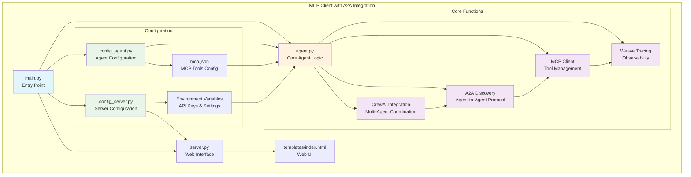

# Search Hackathon Project Architecture

This diagram shows the overall architecture and relationships between components in the search hackathon project.

## Key Components:

### Core Application
- **main.py**: Central orchestrator and entry point - coordinates all system components
- **agent.py**: Core agent functionality with A2A discovery, MCP client, Weave tracing, and CrewAI integration
- **server.py**: Web server handling HTTP requests and serving templates

### Configuration Management
- **config_agent.py**: Agent configuration management - handles agent settings and capabilities
- **config_server.py**: Server configuration management - manages web interface and API settings
- **mcp.json**: MCP tools configuration - defines available tools and their endpoints

### Core Functions (within agent.py)
- **A2A Discovery**: Agent-to-Agent protocol for dynamic agent discovery (ports 1000-1010)
- **MCP Client**: Tool management and Model Context Protocol implementation
- **Weave Tracing**: Observability and performance monitoring for all operations
- **CrewAI Integration**: Multi-agent coordination and task orchestration

## Architecture Flow:
1. The main application (`main.py`) serves as the central orchestrator
2. It connects to both the server (`server.py`) and agent systems
3. MCP tools are configured to work with the agents through `mcp.json`
4. The server provides a web interface using HTML templates
5. Comprehensive testing suite ensures functionality across all components
6. Documentation provides guidance for each major component and integration 