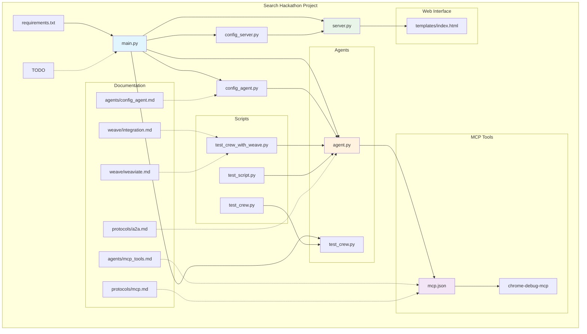

# Search Hackathon Project Architecture

This diagram shows the overall architecture and relationships between components in the search hackathon project.

## Key Components:

### Core Application
- **main.py**: Central orchestrator and entry point
- **server.py**: Web server handling HTTP requests and serving templates
- **config_agent.py**: Agent configuration management
- **config_server.py**: Server configuration management

### Agents System
- **agent.py**: Core agent functionality
- **test_crew.py**: Crew-based testing for agents

### MCP Integration
- **mcp.json**: Configuration for Model Context Protocol tools
- **chrome-debug-mcp**: Chrome debugging tool integration

### Testing Suite
- **test_crew_with_weave.py**: Weave integration testing
- **test_crew.py**: General crew testing
- **test_script.py**: Additional test functionality

### Documentation
- **agents/**: Agent-specific documentation
- **protocols/**: Protocol documentation (A2A, MCP)
- **weave/**: Weave and Weaviate integration guides

### Web Interface
- **templates/index.html**: Main web interface template

## Architecture Flow:
1. The main application (`main.py`) serves as the central orchestrator
2. It connects to both the server (`server.py`) and agent systems
3. MCP tools are configured to work with the agents through `mcp.json`
4. The server provides a web interface using HTML templates
5. Comprehensive testing suite ensures functionality across all components
6. Documentation provides guidance for each major component and integration 